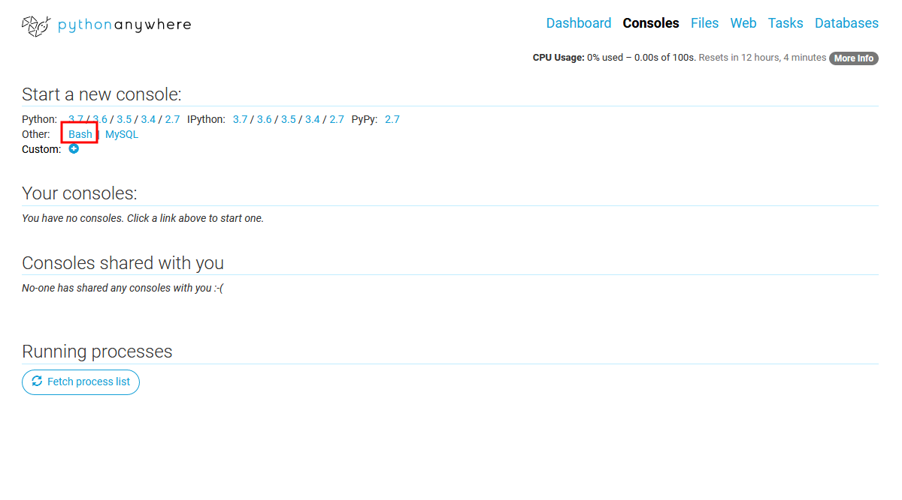
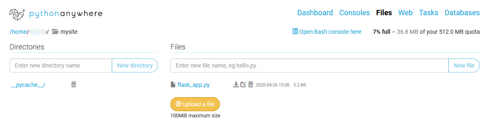

# ChatManagerWebhook
🐍Python webhook for [Чат-Менеджер](https://vk.com/cm).

## Сначала прочитайте эту статью: https://vk.com/@chatmanage-callback-api.

Зарегистрируйтесь на [PythonAnywhere](pythonanywhere.com) и создайте приложение на **Flask** с версией Python 3.7
 
### Далее в /mysite будет файл flask_app.py. В репозитории он называется так же. Вы можете скопировать код с репозитория и вставить его в файл flask_app.py Должно получиться так:
 
После этого перезагрузите приложение. Ваш сервер готов. 
Теперь можно настроить вебхук по статье. 
Получите токен Чат-Менеджера и access_token от ВК. Затем делайте всё по статье выше и замените все данные в файле settings на свои.

`P.S. Если нашли баг - пишите в личные сообщения (https://vk.com/just1nwtf).`
