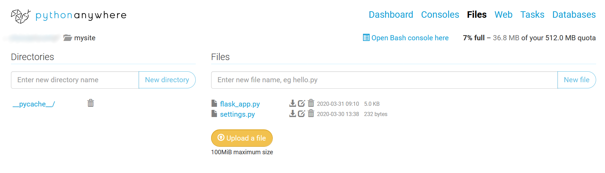

# ChatManagerWebhook
🐍Python webhook for https://vk.com/cm for PythonAnywhere

Сначала прочитайте эту статью: https://vk.com/@chatmanage-callback-api.

Зарегистрируйтесь на PythonAnywhere и создать приложение на Flask. Во вкладке Consoles помощью pip установите библиотеку vk_api (pip install vk-api). Далее в /mysite нужно удалить все файлы и загрузить файлы flask_app.py и settings.py.
 
После этого перезагрузите приложение. Ваш сервер готов. 
Теперь можно настроить вебхук по статье. 
Получите токен Чат-Менеджера и access_token от ВК. Затем делайте всё по статье выше и замените все данные в файле settings на свои.

P.S. Если нашли баг - пишите в личные сообщения (https://vk.com/just1nwtf)
